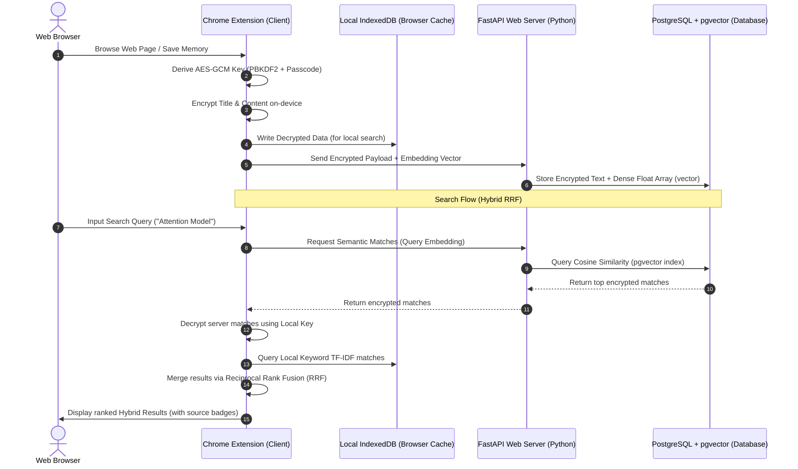

# 🧠 Smarana — Privacy-Preserving Intelligent Second Brain

**Smarana v2** is a secure, local-first browser companion designed to automatically capture, encrypt, rank, and help you retain everything you read on the web. It integrates **local-first keyword search (IndexedDB)** with **semantic vector embeddings (FastAPI + pgvector)** using **Reciprocal Rank Fusion (RRF)**, all while maintaining absolute privacy via **zero-knowledge client-side encryption**.

---

## 🚀 Key Architectural Features 

*   **🔒 Zero-Knowledge Cryptography**: Sensitive page content, titles, and URLs are encrypted on-device using standard **AES-256-GCM** keys derived via **PBKDF2** from your master passcode. The server only stores encrypted ciphertexts and can never read your notes.
*   **🔍 Hybrid Search Engine (RRF)**: Fuses server-side semantic vector search (384-dimensional cosine similarity via `pgvector`) with local full-text search (TF-IDF tokens in browser `IndexedDB`) using **Reciprocal Rank Fusion (RRF)** to deliver unmatched retrieval accuracy.
*   **📅 Spaced Repetition (SM-2)**: Features an active review system driven by the **SuperMemo-2 algorithm** that calculates study intervals based on user recall quality ($0$ to $5$) to optimize long-term memory consolidation.
*   **⚡ Local-First Sync Architecture**: Full offline support. Captured memories are queued in an IndexedDB buffer and synced to the cloud when online, matching offline local caches dynamically on login.
*   **🛠️ Production-Ready Containerization**: Fully parameterized configurations running in separate development (hot-reloaded) and production profiles via Docker Compose.

---

## 🗺️ System Architecture & Data Flow



---

## 🛠️ The Tech Stack

| Layer | Technologies & Frameworks |
| :--- | :--- |
| **Chrome Extension** | TypeScript, Manifest V3 Service Workers, Web Crypto API, IndexedDB, Esbuild |
| **Backend API** | Python, FastAPI, SQLAlchemy (Asyncio), Pydantic Settings, Uvicorn |
| **Database** | PostgreSQL, `pgvector` (Vector index for cosine distance matches) |
| **DevOps / Infra** | Docker, Docker Compose, Multi-Profile Services (`web` vs `web-prod`) |

---

## 🔒 Security Posture

1.  **Zero-Server Knowledge**: Master passcodes never leave the client's browser. Decryption keys are derived and maintained strictly in the extension popup memory.
2.  **CORS Origin Pinning**: In production, FastAPI's `CORSMiddleware` blocks all traffic except the specific Chrome Extension ID whitelist.
3.  **Encrypted Transport**: Built-in support for secure SSL endpoints and environment variable injection to prevent secrets leakage.

---

## ⚙️ Getting Started & Local Development

### Prerequisites
*   **Node.js** (v18+)
*   **Docker & Docker Compose**
*   **Python 3.12** (Optional, if running backend without Docker)

### 1. Backend Setup
1.  Navigate into the backend directory:
    ```bash
    cd backend
    ```
2.  Create your local configuration by copying the template:
    ```bash
    cp .env.example .env
    ```
3.  Generate your secure keys (using `python -c "import secrets; print(secrets.token_hex(32))"` for the JWT secret, and `python -c "import secrets; print(secrets.token_urlsafe(20))"` for the database password) and update the `.env` variables.
4.  Launch the services:
    *   **Development mode** (with volume mounts and auto-reload):
        ```bash
        docker compose up -d --build
        ```
    *   **Production mode** (no hot-reloading, security auditing enabled):
        ```bash
        docker compose up -d --build web-prod
        ```

### 2. Extension Setup
1.  Navigate into the extension directory:
    ```bash
    cd extension
    ```
2.  Install dependencies:
    ```bash
    npm install
    ```
3.  Compile the extension bundles:
    *   **Development** (points to `localhost:8000`):
        ```bash
        npm run build:dev
        ```
    *   **Production** (points to your production server and minifies code):
        ```bash
        npm run build:prod
        ```
4.  Open Google Chrome and navigate to `chrome://extensions/`.
5.  Turn on **Developer Mode** (top right toggle).
6.  Click **Load unpacked** and select the `extension/dist/` directory.

---

## 🏆 Demonstration & Validation
To test type checking and build compliance across the code bases, you can run:
```bash
# In extension/
npx tsc --noEmit
npm run build:prod
```
The FastAPI server will be available at `http://localhost:8000/docs` with auto-generated interactive Swagger API documentation.
